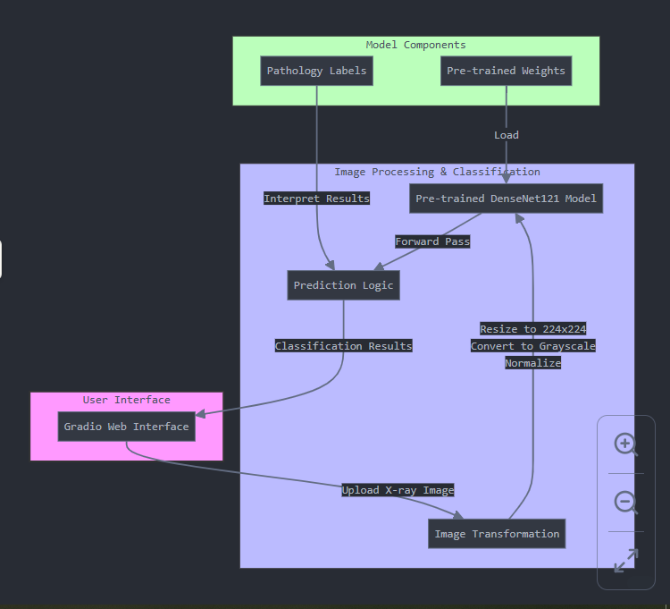
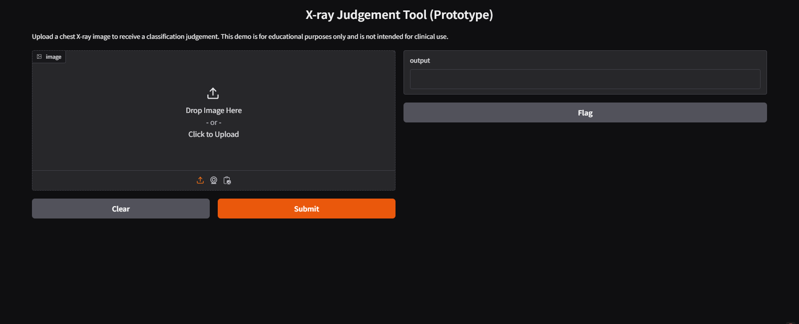
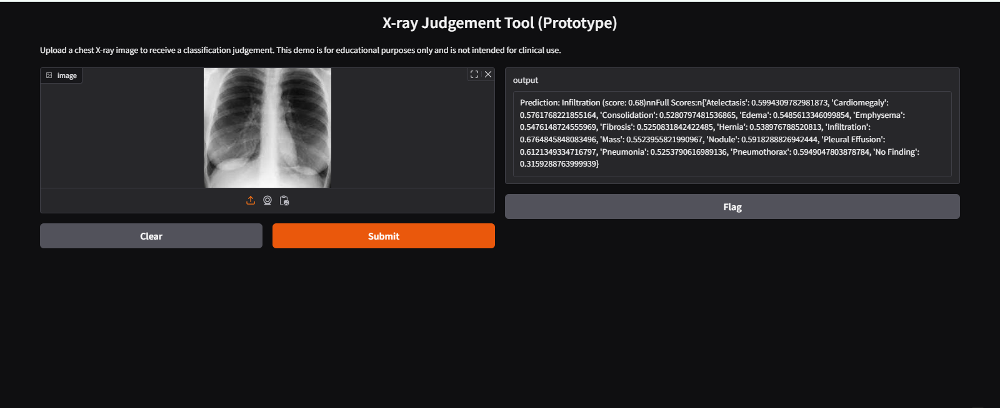

# Developing-Prototype-X-ray-Judgment-Tool-An Open-Source-Medical-Inference-System.

The X-ray Judgment Tool (Prototype) is an open-source medical inference system designed to classify chest X-ray images using a pre-trained DenseNet121 model from torchxrayvision. It provides predictions for various pathology labels, including Pneumonia, Edema, Cardiomegaly, and more. The tool is built with PyTorch and Gradio for user-friendly interface, offering an interactive web-based interface for image classification.

This prototype serves as an educational demonstration of AI-driven medical imaging analysis but is not intended for clinical use. Future improvements could include model fine-tuning on specific datasets, interpretability enhancements, and regulatory compliance for real-world deployment.

This project  guides you through image preprocessing, model inference, and result interpretation, all designed to run seamlessly on Colab without requiring external API keys or logins. Please note that this prototype project is intended for educational purposes only and should not be used as a substitute for professional clinical diagnosis.

The model is not being fine-tuned for clinical diagnostics, so this prototype serves as a valuable starting point for experimenting with medical imaging applications. More work is needed  considering the importance of rigorous validation and adherence to medical standards for real-world use.

# System Design for the Prototype X-Ray Judgment Tool

# Overview of the System Architecture

### 1. User Interface Layer
- **Gradio Web Interface**: Provides a simple, interactive web UI where users can upload chest X-ray images and view the classification results.
- The interface is designed to be accessible through a public URL when hosted on Colab.

### 2. Processing Layer
- **Image Transformation Pipeline**:
  - Resizes uploaded images to 224×224 pixels (required by the neural network)
  - Converts images to grayscale (single channel)
  - Transforms to PyTorch tensor format with appropriate normalization

- **DenseNet121 Model**:
  - Pre-trained torchxrayvision model specialized for chest X-rays
  - Uses densenet121 architecture trained on multiple X-ray datasets
  - Designed to identify 14 different pathological conditions

- **Prediction Logic**:
  - Runs inference on the processed image
  - Maps prediction scores to human-readable pathology labels
  - Sorts and returns results ordered by confidence score

### 3. Data Components
- **Pre-trained Weights**:
  - Downloaded automatically from torchxrayvision repository
  - Weights file: "densenet121-res224-all" which is trained on multiple datasets

- **Pathology Labels**:
  - Either retrieved from model metadata or fallback to hardcoded list
  - Includes conditions like Pneumonia, Cardiomegaly, Edema, etc.

### Implementation Notes
1. The system uses PyTorch as the underlying deep learning framework
2. The torchxrayvision library provides domain-specific models
3. Error handling is implemented to gracefully handle exceptions
4. The prototype explicitly disclaims clinical use (educational only)

This architecture represents a streamlined machine learning inference pipeline specialized for medical imaging, with minimal dependencies and straightforward deployment.

# Gradio Interface of the X-Ray Judgment Tool

#Testing the Deployed App with X-ray Image 

